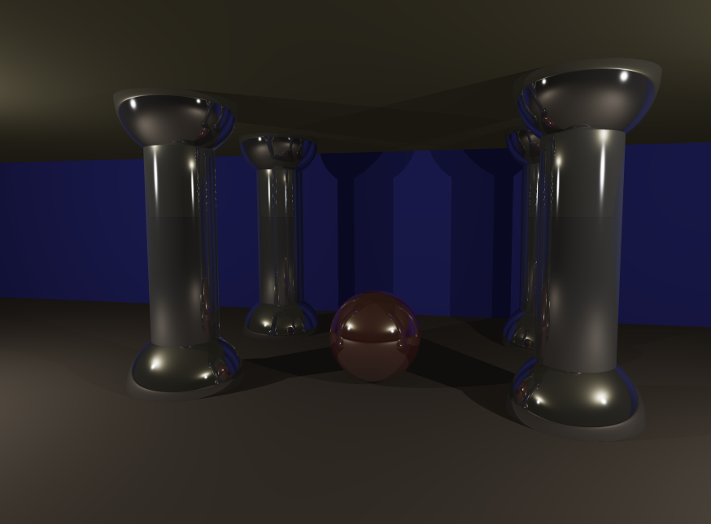

# RT

This project is a ray-trace and is still under development.

## Controls

- ESC : quit the program
- Arrow keys/Space/Shift : moves the camera around
- Mouse wheel : zooms in/out
- Click and drag : move the camera's direction

## Compilation

This project can compil using alternative options, just add the option as argument to the makefile during compilation (OPTION=VALUE):
- OPENCL : TRUE/FALSE (default:TRUE)
- KEYBOARD : AZERTY/QWERTY (default:AZERTY)

---

## Images

